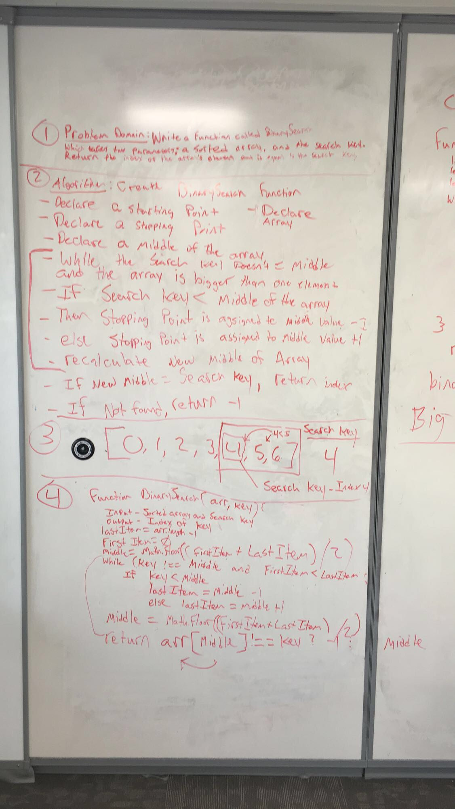

# Binary Search
This is a function called binarySearch that takes in a sorted array and a search key. The program checks to see if the search key is greater than, less than, or equal to the middle index of the array. If the key is greater than or less than the middle index value, the function searches that half of the array. if the middle index value is greater than middle, the function that means the key cannot be in the first half of the array, less than middle index value, then the key must be in the first half of the array. This process is repeated until the key is the middle value of the array. If the key is not in the array the function returns -1.

## Challenge
Write a function called BinarySearch which takes in 2 parameters: a sorted array and the search key. Without utilizing any of the built-in methods available to your language, return the index of the array’s element that is equal to the search key, or -1 if the element does not exist. 

## Solution

