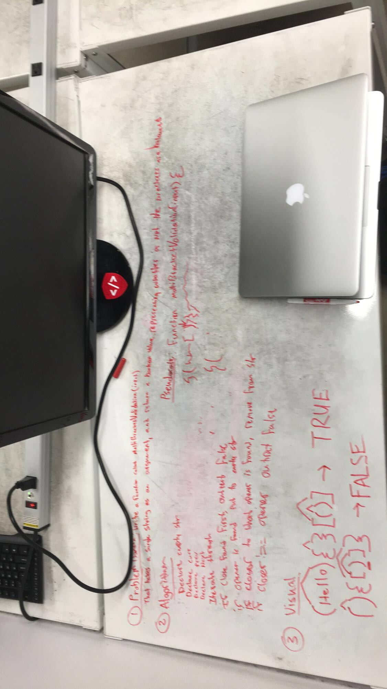

# Whiteboard Challenge 11: Queue with stacks
​
## Challenge
Write a function that takes a string as its only argument, and should return a boolean representing whether or not the brackets in the string are balanced. 

* Round Brackets : ()

* Square Brackets : [] 
* Curly Brackets : {}

## Solution

